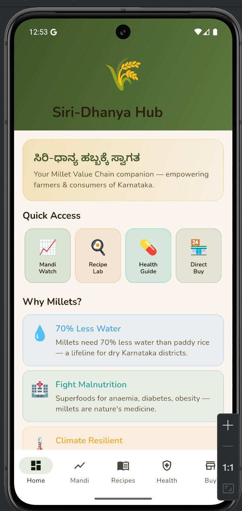
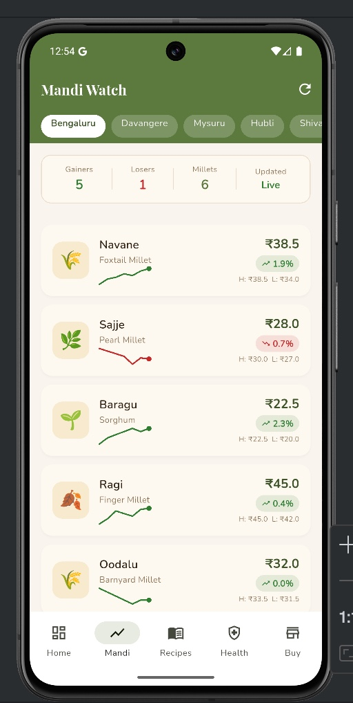
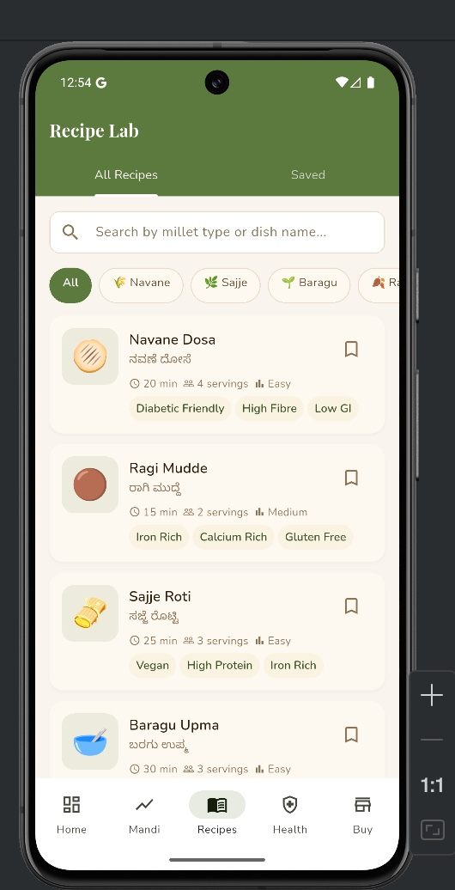
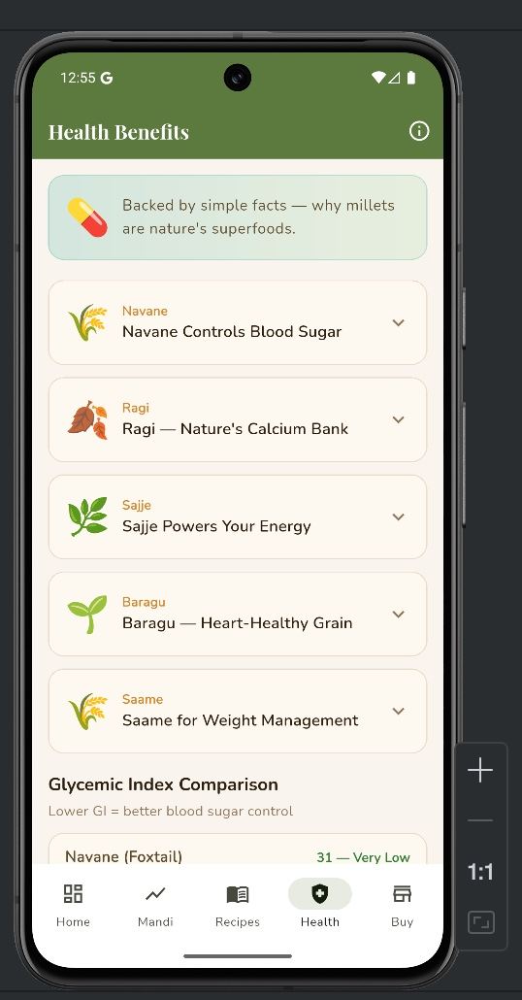
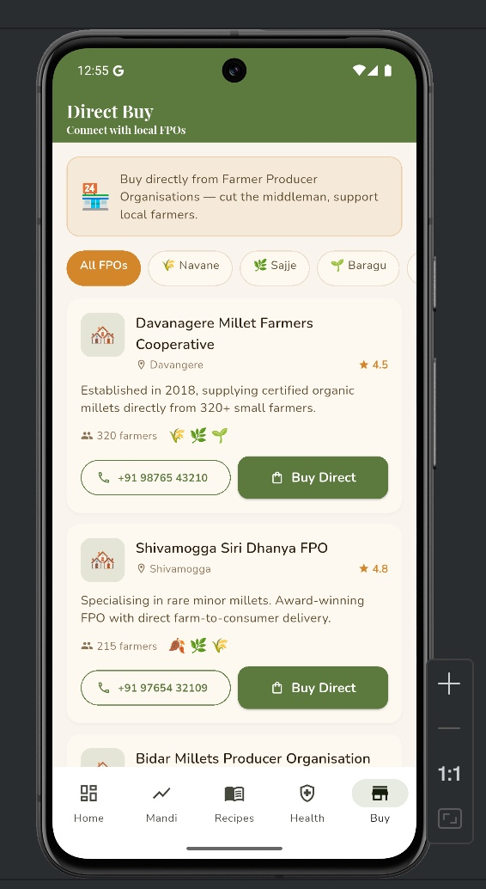

# Siri-Dhanya Hub

> A cross-platform Flutter application digitally supporting Karnataka's millet ecosystem — connecting **consumers, farmers, and Farmer Producer Organizations (FPOs)** through a single, unified platform.

[](https://flutter.dev)
[](https://dart.dev)
[](https://m3.material.io/)
[]()
[]()

---

<p align="center">
  
</p>

---

##  Table of Contents

- [About the Project](#-about-the-project)
- [Problem Statement](#-problem-statement)
- [Key Features](#-key-features)
- [Screenshots](#-screenshots)
- [Tech Stack](#-tech-stack)
- [Architecture](#-architecture)
- [Project Structure](#-project-structure)
- [Getting Started](#-getting-started)
- [Dependencies](#-dependencies)
- [Design Approach](#-design-approach)
- [Supported Millet Varieties](#-supported-millet-varieties)
- [Roadmap](#-roadmap)
- [Contributing](#-contributing)
- [Author](#-author)
- [Acknowledgements](#-acknowledgements)
- [License](#-license)

---

##  About the Project

**Siri-Dhanya Hub** (ಸಿರಿ-ಧಾನ್ಯ ಹಬ್) is a cross-platform mobile application built with **Flutter** that promotes Karnataka's traditional millet ecosystem. Millets are highly nutritious, climate-resilient crops gaining national importance, yet public awareness around varieties, mandi prices, traditional recipes, and direct farmer connectivity remains limited.

This app brings together four core functionalities — **market price tracking, traditional recipes, health awareness, and FPO connectivity** — into one accessible mobile experience designed for consumers, health-conscious users, farmers, and Farmer Producer Organizations.

>  Developed as part of an Android App Development internship at **MindMatrix.io**.

---

##  Problem Statement

Farmers and consumers in the millet ecosystem face several challenges:

-  Lack of centralized, real-time **market price** information
-  Limited awareness of **millet health benefits** and nutritional value
-  Reduced visibility of **traditional millet recipes**
-  Difficulty connecting directly with **Farmer Producer Organizations (FPOs)**
-  Existing apps focus only on crop trading, ignoring education and nutrition

**Siri-Dhanya Hub** solves these gaps by providing an integrated platform for price tracking, recipe discovery, nutritional awareness, and direct farmer-consumer interaction — all in a single app.

---

##  Key Features

###  Dashboard Home
A welcoming landing screen featuring a **Kannada greeting** (ಸಿರಿ-ಧಾನ್ಯ ಹಬ್ಬಕ್ಕೆ ಸ್ವಾಗತ), **Quick Access** cards for all major modules, and a "**Why Millets?**" section highlighting the environmental and health benefits — 70% less water usage, climate resilience, and nutritional power.

###  Mandi Watch
- Tracks millet market prices across **five Karnataka cities**: Bengaluru, Davangere, Mysuru, Hubli, and Shivamogga
- **Live updates** with Gainers/Losers counters
- Displays **current price, % change, daily high/low**
- Graphical **sparkline trends** powered by `fl_chart`
- Covers all major millets — Navane, Sajje, Baragu, Ragi, Oodalu, Saame

###  Recipe Lab
- Traditional millet recipes in **English + Kannada** (e.g. Navane Dosa / ನವಣೆ ದೋಸೆ)
- Each recipe shows **cook time, servings, and difficulty**
- **Category filters** by millet type (Navane, Sajje, Baragu, Ragi…)
- **Search** by millet type or dish name
- **Bookmark** favorite recipes (persisted via `SharedPreferences`) — accessible under the *Saved* tab
- Smart tags: *Diabetic Friendly*, *High Fibre*, *Low GI*, *Iron Rich*, *Calcium Rich*, *Gluten Free*, *Vegan*, *High Protein*

###  Health Benefits
- Backed-by-facts overview — "*why millets are nature's superfoods*"
- **Expandable cards** for each millet variety with detailed nutrition
- **Glycemic Index Comparison** chart (Lower GI = better blood sugar control)
- Quick highlights: *Navane Controls Blood Sugar*, *Ragi — Nature's Calcium Bank*, *Sajje Powers Your Energy*, *Baragu — Heart-Healthy Grain*, *Saame for Weight Management*

###  Direct Buy — FPO Directory
- Browse regional **Farmer Producer Organizations** with full contact info
- Filter FPOs by millet type (All FPOs / Navane / Sajje / Baragu…)
- See **ratings, farmer counts, specializations, and certifications**
- **Direct call** buttons and **Buy Direct** action — cutting out the middleman
- Examples: *Davanagere Millet Farmers Cooperative* (4.5, 320 farmers), *Shivamogga Siri Dhanya FPO* (4.8, 215 farmers), *Bidar Millets Producer Organisation*

###  Additional UX Features
-  Pull-to-refresh on all data screens
-  Smooth bottom navigation across 5 sections (Home, Mandi, Recipes, Health, Buy)
-  Responsive layouts for phone, tablet, web, and desktop
-  Earthy, agriculture-inspired visual theme with parchment backgrounds

---

##  Screenshots

<table align="center">
  <tr>
    <td align="center"><b>Home Dashboard</b></td>
    <td align="center"><b>Mandi Watch</b></td>
    <td align="center"><b>Recipe Lab</b></td>
  </tr>
  <tr>
    <td></td>
    <td></td>
    <td></td>
  </tr>
  <tr>
    <td align="center">Welcome screen with Quick Access cards and "Why Millets?" section</td>
    <td align="center">Real-time millet prices with sparkline trends across 5 cities</td>
    <td align="center">Traditional recipes with smart filters and bookmarking</td>
  </tr>
</table>

<table align="center">
  <tr>
    <td align="center"><b>Health Benefits</b></td>
    <td align="center"><b>Direct Buy (FPO Directory)</b></td>
  </tr>
  <tr>
    <td></td>
    <td></td>
  </tr>
  <tr>
    <td align="center">Nutritional info & glycemic index comparison</td>
    <td align="center">Connect directly with regional FPOs — cut the middleman</td>
  </tr>
</table>

---

##  Tech Stack

| Layer | Technology |
|---|---|
| **Framework** | Flutter |
| **Language** | Dart |
| **State Management** | Provider |
| **Local Storage** | SharedPreferences |
| **UI System** | Material Design 3 |
| **Charts** | fl_chart |
| **Typography** | Playfair Display (headings), Nunito (body) |
| **Architecture** | Modular Multi-Screen Architecture |
| **Target Platforms** | Android, iOS, Web, Windows, Linux, macOS |

---

##  Architecture

Siri-Dhanya Hub follows a **modular multi-screen architecture** with clean separation of concerns:

```

              UI Layer                   
      (Screens + Reusable Widgets)       

                 

         State Management Layer          
        (Provider / ChangeNotifier)      

                 

           Data Layer                    
  (Models + Seed Data + SharedPrefs)     

```

**Layers:**
- **Models** — Strongly typed Dart classes for Millets, Recipes, Prices, FPOs
- **Providers** — State containers (e.g. `RecipeProvider`, `PriceProvider`, `BookmarkProvider`)
- **Screens** — Top-level routes (Home, Mandi, Recipes, Health, Buy)
- **Widgets** — Reusable components (cards, charts, filters)
- **Theme** — Centralized colors, typography, spacing

---

##  Project Structure

```
siri_dhanya_hub/
 android/                  # Android-specific code
 ios/                      # iOS-specific code
 web/                      # Web build configuration
 windows/ macos/ linux/    # Desktop platform code
 assets/
    images/              # Millet illustrations & icons
    fonts/               # Playfair Display, Nunito
    screenshots/         # README screenshots
 lib/
    main.dart            # App entry point
    models/              # Data models
       millet.dart
       recipe.dart
       price_data.dart
       fpo.dart
    providers/           # State management
       recipe_provider.dart
       price_provider.dart
       bookmark_provider.dart
    screens/             # App screens
       home_screen.dart
       mandi_watch_screen.dart
       recipe_lab_screen.dart
       health_benefits_screen.dart
       direct_buy_screen.dart
    widgets/             # Reusable UI components
       millet_card.dart
       price_sparkline.dart
       recipe_tile.dart
       fpo_card.dart
    data/                # Seed data
       millet_data.dart
       recipe_data.dart
       fpo_data.dart
    theme/               # App theming
        app_colors.dart
        app_typography.dart
        app_theme.dart
 test/                    # Unit & widget tests
 pubspec.yaml             # Project dependencies
 README.md
```

---

##  Getting Started

### Prerequisites

Make sure you have the following installed:

- **Flutter SDK** (≥ 3.0.0) — [Install guide](https://docs.flutter.dev/get-started/install)
- **Dart SDK** (bundled with Flutter)
- **Android Studio** or **VS Code** with the Flutter plugin
- **Git**

Verify your setup:
```bash
flutter doctor
```

### Installation

1. **Clone the repository**
   ```bash
   git clone https://github.com/risixl/SiriDhanyaHub.git
   cd SiriDhanyaHub/siri_dhanya_hub
   ```

2. **Install dependencies**
   ```bash
   flutter pub get
   ```

3. **Run the app**
   ```bash
   # Run on connected device or emulator
   flutter run

   # Run on a specific platform
   flutter run -d chrome      # Web
   flutter run -d windows     # Windows
   flutter run -d macos       # macOS
   ```

### Build for Release

```bash
# Android APK
flutter build apk --release

# Android App Bundle (Play Store)
flutter build appbundle --release

# iOS
flutter build ios --release

# Web
flutter build web --release

# Windows / macOS / Linux
flutter build windows
flutter build macos
flutter build linux
```

---

##  Dependencies

Key packages used in this project (see `pubspec.yaml` for the full list):

```yaml
dependencies:
  flutter:
    sdk: flutter
  provider: ^6.1.1            # State management
  shared_preferences: ^2.2.2  # Local persistence (bookmarks)
  fl_chart: ^0.66.0           # Price trend sparklines
  google_fonts: ^6.1.0        # Playfair Display & Nunito
  cupertino_icons: ^1.0.6
```

Install them with:
```bash
flutter pub get
```

---

##  Design Approach

The visual identity reflects Karnataka's traditional farming culture:

-  **Parchment-style backgrounds** for an earthy, warm feel
-  **Millet-green accent colors** as the primary brand hue
-  **Playfair Display** for headings — gives a traditional, editorial tone
-  **Nunito** for body text — modern, highly legible
-  **Kannada bilingual elements** to honor regional roots
-  **Material Design 3** components for consistency and accessibility
-  **Responsive layouts** adapting from phone → tablet → desktop

---

##  Supported Millet Varieties

| Local Name | English Name | Highlight |
|---|---|---|
| **Navane** (ನವಣೆ) | Foxtail Millet | Controls blood sugar |
| **Sajje** (ಸಜ್ಜೆ) | Pearl Millet | Powers your energy |
| **Baragu** (ಬರಗು) | Proso Millet / Sorghum | Heart-healthy grain |
| **Ragi** (ರಾಗಿ) | Finger Millet | Nature's calcium bank |
| **Oodalu** (ಊದಲು) | Barnyard Millet | High fibre, gluten-free |
| **Saame** (ಸಾಮೆ) | Little Millet | Aids weight management |

---

##  Roadmap

- [x] Dashboard home screen with Kannada greeting
- [x] Mandi Watch with sparkline price trends across 5 cities
- [x] Recipe Lab with bookmarking and category filters
- [x] Health Benefits with glycemic index comparison
- [x] FPO Directory with direct call & buy actions
- [ ] **Live price API integration** (currently uses seed data)
- [ ] **Multi-language support** (Kannada, Hindi, English toggle)
- [ ] **User authentication** via Firebase Auth
- [ ] **FPO order placement & tracking**
- [ ] **AI-powered recipe suggestions** based on available ingredients
- [ ] **Push notifications** for price alerts
- [ ] **Dark mode** support

---

##  Contributing

Contributions, issues, and feature requests are welcome!

1. Fork the project
2. Create your feature branch (`git checkout -b feature/AmazingFeature`)
3. Commit your changes (`git commit -m 'Add some AmazingFeature'`)
4. Push to the branch (`git push origin feature/AmazingFeature`)
5. Open a Pull Request

---

## ‍ Author

**Riya Singh**
-  B.E. in Computer Science & Engineering, CMR Institute of Technology
-  Android Developer Intern @ MindMatrix.io
-  GitHub: [@risixl](https://github.com/risixl)

---

##  Acknowledgements

This project was developed during my internship at **[MindMatrix.io](https://mindmatrix.io)** (a product of CL Infotech Pvt. Ltd.) through the VTU Internship Portal.

Special thanks to:

- **Prof. Priti Badar** — Assistant Professor, Dept. of CSE, CMRIT (Internship Guide)
- **Dr. Prem Kumar Ramesh** — HOD, Dept. of CSE, CMRIT
- **MindMatrix mentors** — for technical guidance throughout the program
- The **Flutter** and **Dart** open-source communities

### References

- [Android Basics with Compose – Google](https://developer.android.com/courses/android-basics-compose/course)
- [Flutter Documentation](https://docs.flutter.dev/)
- [Material Design 3](https://m3.material.io/)
- [fl_chart package](https://pub.dev/packages/fl_chart)
- [Provider package](https://pub.dev/packages/provider)

---


</div>
